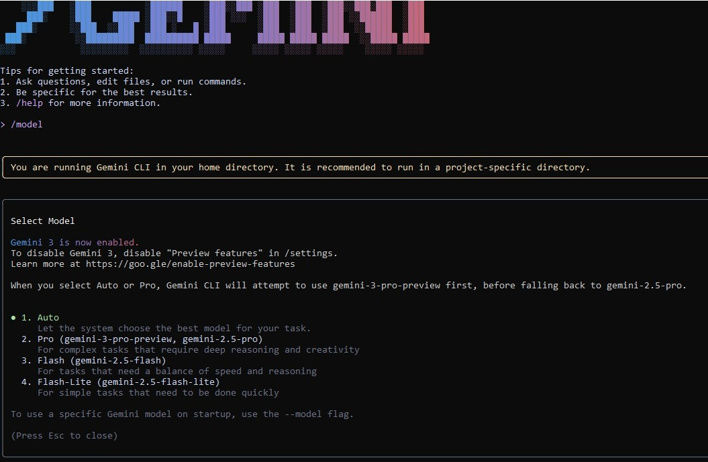

# PART A — Research Questions (Short Answers)

## 1. What new improvements were introduced in Gemini 3.0?

- Gemini 3.0  zyada tez aur deep thinking kar sakta hai (reasoning behtar hai), text ke saath images aur code ko bhi samajh sakta hai (multimodal), aur “agent” bana kar multi-step kaam (jaise email ya trip planning) khud kar sakta hai.

## 2. How does Gemini 3.0 improve coding & automation workflows?

- Vibe Coding: tum sirf idea do, aur Gemini functional code bana deta hai.  
- Agents editor, terminal aur browser use karke multi-step coding tasks khud complete kar sakte hain.  
- Bara context window poori codebase ko ek saath samajhne mein madad karta hai.  
- Code debugging, refactoring aur test generation zyada accurate aur fast ho gaya hai.  
- Automation workflows ke liye agents steps plan karke verify bhi karte hain.

## 3. How does Gemini 3.0 improve multimodal understanding?

- Text, images, audio, video aur code ko ek saath zyada smart tareeke se samajhta hai.  
- Vision reasoning improve hui hai, complex images aur documents ko better analyze karta hai.    
- Deep Think mode se complicated multimodal problems ko aur gehrai se solve karta hai.

## 4. Name any two developer tools introduced with Gemini 3.0.

- **Google Antigravity** – for building and running AI agents.  
- **Gemini CLI** – Open-source command-line tool for executing Gemini agents.  

# PART B — Practical Task (Screenshot Required)

